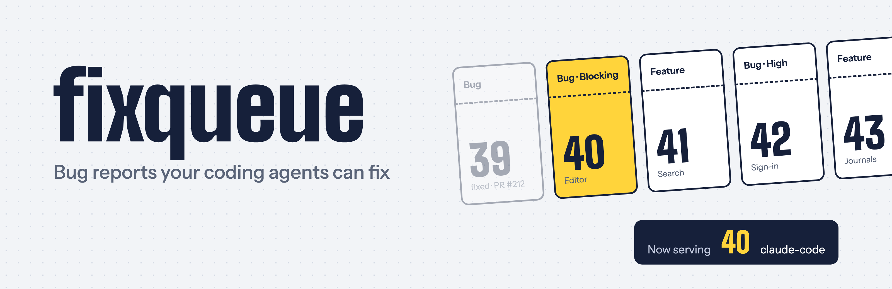
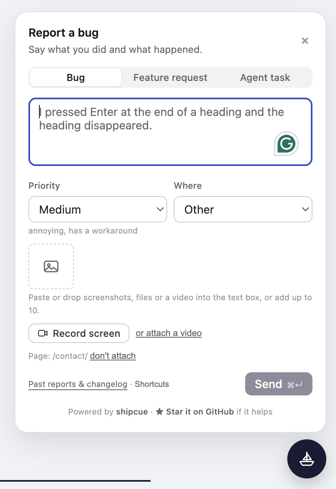

<div align="center">

<a href="https://shipcue.ibuildathing.com"></a>

<br>

<a href="LICENSE"></a>   

# shipcue: Bug Reports Your Coding Agents Can Fix

**Drop-in report button** &nbsp;•&nbsp; **Queue in your own Postgres** &nbsp;•&nbsp; **Agents claim over MCP** &nbsp;•&nbsp; **One report, one agent**

🌐 [Website](https://shipcue.ibuildathing.com) &nbsp;•&nbsp; ☁️ [Cloud](https://shipcue.ibuildathing.com/cloud/) &nbsp;•&nbsp; 📖 [Docs](https://shipcue.ibuildathing.com/docs/) &nbsp;•&nbsp; 📝 [Blog](https://shipcue.ibuildathing.com/blog/) &nbsp;•&nbsp; ✉️ [Contact](https://shipcue.ibuildathing.com/contact/)

</div>

---

A drop-in bug report and feature request button whose inbox is a queue that people **and coding agents** both work from.

<p align="center"></p>

Someone in your app clicks the button, says what broke or what they want, pastes a screenshot, and sends. shipcue files it with the page address, browser and a snapshot of app state you choose. Then Claude Code, Codex or a teammate claims the most urgent report, gets a ready-made task prompt, fixes it, and closes it with the PR link.

```
user files a report  →  queue (your Postgres)  →  agent claims the top one  →  PR  →  closed as fixed
```

- **Self-hosted.** One table in your own Postgres. No third-party dashboard, no per-seat pricing.
- **Agent-ready.** Every report carries enough context to act on, and an MCP server lets agents pull from the queue without two of them ever taking the same report.
- **No CSS setup.** The button uses inline styles and takes an accent colour.

It started as the report button inside three apps (a founders dashboard, a hackathon platform and a block outliner) and was pulled out once the same five parts kept showing up: a button, a form, automatic context, storage, and somewhere for reports to go.

## Use cases

- **Hackathon teams running many agents.** Everyone reports into one queue and each agent claims one report at a time, so two agents never fix the same bug and nobody's fix undoes someone else's.
- **Founders with early users.** Users report from the page where it broke, with context attached. Your agent works the queue, most urgent first, and you review the PRs.
- **Internal tools and dashboards.** An inline button in the header, sign-in required, new reports posted to Slack or email, and the data stays in your database.
- **Beta tests and dogfooding sessions.** Testers file what they hit; areas and priority keep the pile in order for the agents.
- **Feature requests too.** An agent can draft one as a PR, or you close it as won't fix with a reason.

More on the [use cases page](https://shipcue.ibuildathing.com/use-cases/).

## Install

```bash
pnpm add shipcue
```

Until the first npm release is out, install the prebuilt release (nothing builds on install, so it works with pnpm on Vercel):

```bash
pnpm add https://github.com/cyu60/shipcue/releases/download/v0.5.2/shipcue-0.5.2.tgz
```

## 1. Create the table

Run [`sql/schema.sql`](sql/schema.sql) on your database (Supabase, InsForge, Neon, RDS or local Postgres). Upgrading from 0.1: run it again; it adds the `video` column to the existing table.

## 2. Mount the handler

Next.js App Router, `app/api/shipcue/[...path]/route.ts`:

```ts
import { Pool } from 'pg';
import { createShipcueHandler, postgresStore } from 'shipcue/server';
import { resolveConfig } from 'shipcue';

const pool = new Pool({ connectionString: process.env.DATABASE_URL });

const handler = createShipcueHandler({
  store: postgresStore(pool),
  config: resolveConfig({ areas: [{ value: 'editor', label: 'Editor' }, { value: 'billing', label: 'Billing' }] }),
  getReporter: async (req) => (await getSession(req))?.email ?? null, // your auth
  requireReporter: true,
  agentToken: process.env.SHIPCUE_TOKEN, // leave unset to switch the agent API off
  onReport: async (report) => {
    // email the team, post to Slack, mirror to your task board...
  },
});

export { handler as GET, handler as POST };
```

The handler is a plain `(Request) => Promise<Response>`, so it also works in Hono, Remix, Bun, Deno and Cloudflare Workers. Screenshots are stored as data URLs unless you pass `saveScreenshot(file, key)` to upload them to S3, Supabase Storage or similar.

**Videos.** Pass `saveVideo(file, key)` to turn on `POST /reports/:id/video`: whoever filed a report can attach one screen recording or video (WebM, MP4 or MOV, up to 40 MB) within 30 minutes. Hosts that cap request bodies (Vercel: 4.5 MB) should upload from the browser instead, with the button's `uploadVideo` prop and a presigned URL.

## 3. Add the button

```tsx
import { ReportButton } from 'shipcue/react';

<ReportButton
  areas={[{ value: 'editor', label: 'Editor' }, { value: 'billing', label: 'Billing' }]}
  accentColor="#8c1515"
  diagnostics={() => ({ route: location.pathname, openDoc: store.docId, lastAction: store.lastAction })}
/>
```

Use `variant="inline"` for a header or toolbar button on phones, where a floating bubble covers the controls. Pass `submit={(form) => myServerAction(form)}` to send through a server action instead of `fetch`. Pass `reporter={user.email}` to say who is signed in on your site: it goes with each report in the `x-shipcue-user` header, shipcue Cloud shows it as the reporter, and your own handler can read it in `getReporter`.

What else the panel does:

- **Record screen or attach a video.** Recordings stop at 60 seconds. The video uploads after the report is filed; if it fails, the report is still filed and the panel says so. Pass `uploadVideo={(reportId, blob) => …}` to upload it yourself; otherwise it goes to the handler. With `submit` and no `uploadVideo`, video is hidden.
- **Recent errors.** Page errors, unhandled rejections and `console.error` calls from before the report are added to the snapshot as `recentErrors`. Turn off with `captureErrors={false}`.
- **The page.** The panel shows which page it will attach, with a "don't attach" link.
- **Move it.** People can drag the floating button anywhere; `movable={false}` keeps it bottom-right.
- **Your own mark.** The button shows shipcue's hard hat; `icon="ship"` brings back the sailboat, and `launcherIcon={<YourLogo />}` draws your own logo.
- **Dictate.** A small mic beside the text box (and ⌃M / Alt+Shift+M) types what you say, using the browser's speech recognition; it is listed in Shortcuts and hidden in browsers without it.
- **Your own words.** Pass `text={{ seeReports: 'See your reports', bugTab: 'Problem', send: 'Submit' }}` to the button or the board: anything you leave out keeps shipcue's wording (`DEFAULT_TEXT` from `shipcue/react` lists every key).
- **Limits.** Set them once where you create the handler, `config: resolveConfig({ areas, maxScreenshots: 20, maxTotalScreenshotBytes: 4 * 1024 * 1024 })`, and the button follows (it reads them from `{endpoint}/capabilities`). If you send reports yourself with `submit`, pass the same numbers as `limits={{ maxScreenshots: 20 }}`. Defaults: 10 screenshots, 5 MB each, 4 MB together (under Vercel's 4.5 MB request cap), 40 MB and 60 seconds of video.
- **Videos past 4.5 MB.** Hosts like Vercel cap a request at 4.5 MB, so for longer recordings upload the video from the browser straight to your storage with `uploadVideo`, then post its URL to `{endpoint}/reports/:id/video` as `{ url }`; the handler checks it with `acceptVideoUrl(url, id)`. shipcue's own site does this with Vercel Blob client uploads (`website/_src/button.mjs`, `website/_src/upload.mjs`).
- **Any file.** `resolveConfig({ allowFiles: true })` lets people attach PDFs, logs and other files next to screenshots, under the same limits (never HTML, SVG or scripts). Off by default: turn it on where whoever reads your reports can open any file. Files never show on the public board.
- **Past reports.** `pastReportsHref="/reports"` adds a Past reports link to the panel and a See your reports link after sending; `pastReportsLabel` changes its text.

The panel has three tabs: **Bug**, **Feature request** and **Agent task** (a direct instruction for an agent; limit them with `types={['bug', 'feature']}` on a public page). The panel ends with a small "Powered by shipcue · ★ Star it on GitHub" line. If shipcue helps you, a star really helps; `watermark={false}` turns it off.

### Keyboard shortcuts

| | Mac | Windows / Linux |
|---|---|---|
| Agent task | ⌘J | Alt+Shift+J |
| Bug | ⌃B | Alt+Shift+B |
| Feature request | ⌃F | Alt+Shift+F |
| Send | ⌘↵ | Ctrl+↵ |

Text highlighted on the page comes along in an editable, removable **Context** box (an outline opens as a Preview with bullets and `[[links]]`; Raw is the text; `renderContext` draws the Preview with your app's own renderer) (or pass `getContext` to supply your app's selected rows or blocks), and agents get it as its own section of the task prompt. Change the keys with `hotkeys={{ task: ['Mod+J'] }}` ("Mod" is ⌘ on a Mac, Ctrl elsewhere), turn them off with `hotkeys={false}`, or open the panel from your own menu with `openReport('task')`. People can also change their own keys from the panel's small Shortcuts link; their choice is kept in their browser and wins over yours. If your app's own keymap opens shipcue (`hotkeys={false}`), pass `onEditShortcuts={openYourKeymapEditor}` and the link opens that instead.

### Your own tabs

An app with its own flow (say an agent-task composer backed by its API) can draw it as a tab in the same panel: `extraTabs={[{ id: 'agent', label: 'Agent task', render: ({ text, context, close }) => <TaskComposer … /> }]}`. Give it a hotkey with `hotkeys={{ agent: ['Mod+J'] }}` or open it with `openReport('agent')`; `onOpenChange` and `closeReport()` let the app follow and close the panel. If the app already has a help button, `trigger={false}` hides shipcue's own and the app opens the panel with `openReport('bug')`.

## 4. Let agents work the queue

```bash
claude mcp add shipcue \
  -e SHIPCUE_URL=https://your.app/api/shipcue \
  -e SHIPCUE_TOKEN=... \
  -- npx shipcue-mcp
```

Tools: `list_reports`, `claim_next_report`, `get_report`, `claim_report`, `release_report`, `close_report`, `submit_for_review`, `heartbeat_report`, `list_my_reports`.

**One token per agent.** Pass `agents: async (token) => ({ id, name, pull?, types?, leaseSeconds? }) | null` to the handler and each agent claims under its own name, can only release or close what it holds, and (with `pull: false`) only takes what someone assigned to it. `leaseSeconds` gives agent claims a lease: an agent that stops calling `heartbeat_report` loses the report back to the queue. `submit_for_review` puts the report in review with the PR link, with no lease, until it is closed.

`claim_next_report` hands back a prompt like this:

````md
# Bug [Blocking] Editor: Enter at the end of a heading deletes it

Enter at the end of a heading deletes it

## Where
Report id: a44f5541-…
Page: https://your.app/page/42
Filed: 2026-10-01T23:01:08Z by ada@example.com

## App snapshot
```json
{ "blocks": 7, "lastAction": "split-block" }
```

## What to do
Reproduce it, write a failing test, fix it, and close the report with the PR link.
````

Claims are atomic (`FOR UPDATE SKIP LOCKED`), so several agents can drain the queue at once.

## HTTP API

| Method | Path | Who |
|---|---|---|
| `POST` | `/reports` | the button (multipart form) |
| `POST` | `/reports/:id/video` | the button, the reporter only (multipart, field `video`; needs `saveVideo`) |
| `GET` | `/reports?status=open` | agent, bearer token |
| `GET` | `/reports/:id` | agent |
| `POST` | `/reports/next/claim` | agent |
| `POST` | `/reports/:id/claim` | agent |
| `POST` | `/reports/:id/release` | agent |
| `POST` | `/reports/:id/close` | agent, `{ status: "fixed" \| "wontfix", resolution, prUrl? }` |
| `POST` | `/reports/:id/heartbeat` | agent: renew its lease |
| `POST` | `/reports/:id/review` | agent, `{ prUrl }`: a PR is up, the report is in review |
| `GET` | `/reports/:id/events` | agent: the report's history |
| `GET` | `/reports?mine=1` | agent: what it holds or has queued |
| `GET` | `/team/me`, `/team/reports`, `/team/reports/:id` | signed-in members, with the `team` option |
| `POST` | `/team/reports/:id/{claim,assign,release,close,reopen,review,priority}` | members (not viewers) |
| `GET` | `/board` | anyone, only with `board` on: the queue and the changelog |
| `GET` | `/board/version` | anyone, only with `board` on: a short string that changes when any report does |
| `GET` | `/capabilities` | the button: what this handler takes (video, files, limits) |

## Queue and changelog pages

Switch on `board` in the handler (`true`, or `(req) => boolean` to limit who sees it), then render `<ShipcueBoard endpoint="/api/shipcue" />` (or `<ShipcueQueue />` / `<ShipcueChangelog />`) from `shipcue/react`. It lists open and in-progress reports, most urgent first, and fixed ones with their resolution, latest first. No reporter, page, diagnostics or attachments ever leave the server. Close reports with a one-line, user-facing `resolution` and the changelog writes itself. With both lists it shows Open / Fixed / All / Changelog pills with counts, and a small View control lets each viewer switch to tabs or a compact list (`tabStyle`, `layout`, `viewPicker`) (`initialView` sets where it starts). Add `boardScreenshots: true` to show each report's screenshots too: off by default, since screenshots can show private things. The board is live: it checks a tiny `/board/version` every 5 seconds while the page is in view and re-reads as soon as a report is filed or changes (`liveMs`, 0 turns it off).

## The CueLog table

For the team: every report in full, claimed and worked by people and agents together. Give the handler a `team` option, `{ getMember: (req) => ({ id, name, role: 'owner' | 'member' | 'viewer' }) | null, claimants: (req) => [{ kind: 'person' | 'agent', id, name }] }`, and render `<CueLogTable endpoint="/api/shipcue" />` from `shipcue/react` on a signed-in page. It has Open / Mine / In review / Fixed / All pills, filters (type, priority, who has it, search), sorting (queue order, longest waiting, recently updated, claimant), a List and a Board view (drag between columns), inline priority and assignee, bulk actions, and a side panel with screenshots, the app snapshot, the agent prompt and the report's history. Unowned work says "Nobody yet" in amber; an agent's lease and a stale claim show as badges. Assigning to an agent queues the report for it: its `claim_next_report` returns that report first. Every change is kept in `shipcue_report_events`.

Or use [shipcue Cloud](https://shipcue.ibuildathing.com/cloud/): the same table, hosted, with projects, invites and agent tokens.

## Chrome extension

Report what you see on any page, even sites you do not run: the extension in `extension/` sends your words with a screenshot of the tab, the element you click (selector, text, position, HTML), the text you selected, and the time, time zone, window size and, if you tick it, your location, to any shipcue endpoint. Download it from [shipcue.ibuildathing.com/extension](https://shipcue.ibuildathing.com/extension/), unzip, and load it at `chrome://extensions` → Developer mode → Load unpacked. Set your app's endpoint under ⚙ (it sends to shipcue's own CueLog until then).

## Broadcast and listen

Tell people or agents when something happens to a report. Each broadcaster gets the events it lists (`report.filed`, `report.claimed`, `report.released`, `report.closed`, `report.video`), after the change is saved; one that fails or is slow is logged and never fails the request.

```ts
import { createShipcueHandler, slack, webhook } from 'shipcue/server';

createShipcueHandler({
  // ...
  broadcasters: [
    slack({ webhookUrl: process.env.SLACK_WEBHOOK!, link: 'https://app.example.com/reports' }),
    // Zapier, n8n, an email or SMS bridge, or an agent on a VPS, Mac mini or Tailscale address.
    // Signed: check x-shipcue-signature with signBody(secret, rawBody).
    webhook({ url: 'https://mac-mini.tailnet.ts.net/shipcue', secret: process.env.HOOK_SECRET, events: ['report.filed'] }),
    // Or anything: { name: 'sms', events: ['report.filed'], send: async (e) => sendText(describeEvent(e)) }
  ],
});
```

An agent that would rather not open a port listens instead: `shipcue-listen` polls the queue with the agent token and runs a command per event, with the event as JSON on stdin and `SHIPCUE_EVENT` / `SHIPCUE_REPORT_ID` in its environment, one at a time.

```bash
SHIPCUE_URL=https://app.example.com/api/shipcue SHIPCUE_TOKEN=... \
  npx shipcue-listen --on filed -- claude -p "Fix the newest report in the shipcue queue"
# --on filed,claimed,released,closed,video   --every 15 (seconds)   --backlog   --once
# No command: prints one JSON line per event.
```

## Try it locally

```bash
pnpm install && pnpm build
SHIPCUE_TOKEN=dev node examples/demo-server.mjs
```

## Development

```bash
pnpm test        # vitest; the Postgres store runs against real Postgres via PGlite
pnpm typecheck
pnpm build
```

## Changelog

- **0.15.0**: `ReportButton` takes `reporter` (who is signed in on your site, e.g. `reporter={user.email}`) and sends it in the `x-shipcue-user` header with the report and its video, so shipcue Cloud's CueLog shows who filed each report. Your own handler can read it in `getReporter`. shipcue Cloud also gains Continue with Google and GitHub, enforces each project's list of sites, and lets owners rename a project, give the button a new key, or delete the project.
- **0.14.0**: the CueLog gets stars (pin any report to the top in the panel, the board and the CueLog table; the panel's new Yours list shows what you sent from this browser), an in-page image preview for screenshots everywhere (click to zoom, arrows, Esc), GitHub links on the changelog when the repository is public or the viewer is an admin (`boardLinks`, `boardAdmin`), `anonymousLimit` (a few reports without signing in, then `signInUrl`; signed in, people can still send anonymously), button and text sizes with a Display panel (`buttonSize`, `textSize`) and a hotkey to reset a dragged button (⌃⇧H / Alt+Shift+H). The hat is now Lucide's hard-hat. **Upgrading:** for `anonymousLimit`, run the "Upgrading from 0.13" lines in `sql/schema.sql`.
- **0.13.0**: the CueLog's claim model. A claim names a person or an agent (`claimantKind`, `claimantId`), agents can have their own tokens (`agents`), agent claims can have a lease (`leaseSeconds`, `heartbeat`), a PR puts a report `in_review`, and every change goes to `shipcue_report_events`. New `team` API and `CueLogTable` component; new MCP tools `submit_for_review`, `heartbeat_report`, `list_my_reports`. **Upgrading:** run the "Upgrading from 0.12" lines at the end of `sql/schema.sql` before deploying (new columns, the `in_review` status and the events table). shipcue Cloud's tables are in `sql/cloud.sql`.
- **0.12.0**: building blocks for a hosted queue (shipcue Cloud): `postgresStore(db, table, { project })` keeps every read and write to one project in a shared table (`sql/cloud.sql` adds `project_id`), and the handler's `cors` option takes reports from listed origins. Both are opt-in; self-hosted apps don't change.
- **0.11.0**: shipcue's mark is now a builder's hard hat (with its headlamp) on the button, the site and the extension; `icon="ship"` keeps the sailboat, `launcherIcon` takes your own. Dictate: a small mic beside the text box (⌃M on a Mac, Alt+Shift+M elsewhere, even with the panel closed) speaks into the report with the browser's own speech recognition; hidden where the browser has none.
- **Extension 0.1.1**: the hard-hat icon.
- **0.10.5**: a quick drag of the button works too (the pointer is held from the press).
- **0.10.4**: drag the floating button anywhere on the page; it stays where you leave it (kept in your browser) and the panel opens toward the middle of the screen. `movable={false}` pins it bottom-right.
- **0.10.3**: in Tabs view only the current tab is underlined (others no longer keep a grey line once visited); shipcue's CueLog opens on the Changelog.
- **0.10.2**: `launcherIcon` puts your own mark on the button in place of the sailboat (the accent background stays).
- **0.10.1**: "+ Add context" under the text box: what your app says is selected (as a preview), or an empty box to type or paste into, on any tab.
- **Extension 0.1.0**: a Chrome extension that reports from any page with a screenshot, a picked element, the selection and page details (time, time zone, location if you allow it). Download at /extension/.
- **0.10.0**: `text`: every word the panel and the board show can be your app's own (tab names, headings, placeholders, buttons, links, the thanks note, empty states); `DEFAULT_TEXT` lists them. `pastReportsLabel` and `seeReportsLabel` still work.
- **0.9.0**: the Context box has a Preview / Raw switch: an outline shows as bullets with nesting, `[[links]]`, `#tags` and `((refs))` set apart; pass `renderContext={(text) => <YourRenderer text={text} />}` to draw it your app's way.
- **0.8.1**: the thanks note says "See your CueLog"; shipcue's own queue page is now CueLog, at /cuelog/.
- **0.8.0**: broadcasters (`slack()`, signed `webhook()`, or your own) hear when a report is filed, claimed, released, closed or gets a video; `shipcue-listen` runs a command per event for agents on a Mac mini, VPS or Tailscale without opening a port; the board updates live (`/board/version`, `liveMs`); list mode stays inside its column.
- **0.7.0**: the board has a small View control, so each viewer picks pills or tabs and cards or a one-line list (kept in their browser; apps set the default with `tabStyle` and `layout`, or hide it with `viewPicker={false}`); the thanks note says "See your cue" (`seeReportsLabel`); shipcue's own Changelog page is now Cue, at /cue/.
- **0.6.9**: `onEditShortcuts`: apps whose own keymap opens shipcue (`hotkeys={false}`) get the panel's Shortcuts link too, opening their shortcut editor.
- **0.6.8**: no hard-coded limits in the panel: it reads how many screenshots, how big, and how long a video may be from the handler (`/capabilities`, i.e. your `resolveConfig`), and apps that send reports with `submit` pass `limits={{ maxScreenshots: 20 }}`.
- **0.6.7**: big videos fail gracefully: the button checks against the handler's real limit (`maxVideoBytes` from `/capabilities`; videos posted to the handler are capped at one request, `maxRequestBytes`, 4.4 MB by default) and says so before sending, keeping what was typed; size refusals from storage become a plain sentence, and the report is still filed.
- **0.6.6**: the panel grows and shrinks with what is in it; paste or drop a video straight into the text box; `allowFiles` takes other files (PDFs, logs) too; `GET /capabilities` tells the button what the handler takes, so it never offers a video it cannot send; `acceptVideoUrl` takes videos uploaded straight to your storage (past Vercel's 4.5 MB request limit); clear errors instead of "Not found".
- **0.6.5**: the board's Open / Fixed / All / Changelog tabs are pills again.
- **0.6.4**: the board's tabs are Open / Fixed / All / Changelog with counts; a small Shortcuts link in the panel lets each person change the hotkeys, saved in their browser.
- **0.6.3**: the board has a Queue / Changelog toggle and can show screenshots (`boardScreenshots`, opt-in); `pastReportsLabel`; the Agent task tab reads "Delegate a task to your agent."
- **0.6.2**: the Queue keeps finished reports, greyed out under the open ones; the board takes the page's own type; no more "ResizeObserver loop" console error from the panel.
- **0.6.1**: `showParam` (e.g. `"shipcue"`) keeps the button and hotkeys off until the page is opened with `?shipcue=true`; the open panel keeps its height instead of jumping as you switch tabs or clear text.
- **0.6.0**: `<ShipcueBoard />` / `<ShipcueQueue />` / `<ShipcueChangelog />` and the opt-in `GET /board`; up to 10 screenshots per report (default, with a 4 MB total so a report fits a 4.5 MB request); hotkeys are caught before the page's own key handlers, so ⌘J always reaches the Agent task tab; reports carry `updatedAt`.
- **0.2.0**: screen recording and video attachments, recent errors in the snapshot, a don't-attach-page link, Past reports links, `attachVideo` on stores. Brought over from the report buttons in the Stanford Founders dashboard and Block Outliner.
- **0.1.0**: first release.

## Roadmap

- Sinks: GitHub Issues, Linear, Slack, email
- Row-level security preset for apps that read the table from the browser
- Notify the reporter when their report is fixed
- Public board with voting for feature requests (optional)
- Comments on a report between the reporter and whoever claimed it

## License

MIT
